The Grey Matter of Securing Android Applications

*Version 1.0*

*6th April, 2018*

*A whitepaper to help developers code a secure Android application by
leveraging the security features provided by Google*

*Whitepaper*

*By*

***Shiv Sahni***

*Senior Security Analyst*

*Lucideus Technologies*

[*[shiv.s\@lucideustech.com]{.underline}*](mailto:shiv.s@lucideustech.com)

[{width="2.581136264216973in"
height="0.8385422134733158in"}](http://lucideus.com/)

[{width="0.28125in"
height="0.28125in"}](https://www.linkedin.com/in/shivsahni/)
[{width="0.3281255468066492in"
height="0.3281255468066492in"}](https://security.stackexchange.com/users/159736/shiv-sahni)
[{width="0.3402690288713911in"
height="0.2760422134733158in"}](https://twitter.com/shiv__sahni)

Table of Contents

**[Abstract](#abstract) 5**

**[Introduction](#introduction) 7**

> [Android Software Stack](#android-software-stack) 7
>
> [APK: Android Application Package](#apk-android-application-package) 8
>
> [APK Internals](#apk-internals) 9
>
> [Android Application Components](#android-application-components) 10

**[Background/Problem Statement](#backgroundproblem-statement) 12**

**[Security Features By Google](#security-features-by-google) 13**

> [Application Sandbox](#application-sandbox) 13
>
> [Notes for Developers](#notes-for-developers) 14
>
> [World Accessible Files](#world-accessible-files) 14
>
> [Rooted Devices](#rooted-devices) 14
>
> [Android Permission Model](#android-permission-model) 16
>
> [Permission Protection Levels](#permission-protection-levels) 16
>
> [Permission Groups](#permission-groups) 16
>
> [Correlation of Application Sandbox and Android Permission
> Model](#correlation-of-application-sandbox-and-android-permission-model)
> 17
>
> [Notes for Developers](#notes-for-developers-1) 18
>
> [Excessive Permissions](#excessive-permissions) 18
>
> [Securing Application Components Using
> Permissions](#securing-application-components-using-permissions) 18
>
> [IPC: Inter Process Communication](#ipc-inter-process-communication)
> 19
>
> [Intents](#intents) 19
>
> [Explicit Intents](#explicit-intents) 19
>
> [Implicit Intents](#implicit-intents) 19
>
> [Intent Filters](#intent-filters) 19
>
> [Notes for Developers](#notes-for-developers-2) 20
>
> [Insecure IPC Mechanisms](#insecure-ipc-mechanisms) 20
>
> [Insecure Android Broadcasts](#insecure-android-broadcasts) 20
>
> [Insecure Implementation of Pending
> Intents](#insecure-implementation-of-pending-intents) 21
>
> [Exploit Mitigation Techniques](#application-signing) 23
>
> [ASLR](#aslr) 23
>
> [Data Execution Prevention](#data-execution-prevention) 23
>
> [Protecting Stack](#protecting-stack) 24
>
> [Notes for Developers](#notes-for-developers-3) 24
>
> [Leveraging Underlying Exploit Mitigation
> Techniques](#leveraging-underlying-exploit-mitigation-techniques) 24
>
> [Usage of Banned Functions and Vulnerable
> Libraries](#usage-of-banned-functions-and-vulnerable-libraries) 25
>
> [Application Signing](#application-signing) 26
>
> [Digital Signature](#digital-signature) 26
>
> [Application Signing Process](#application-signing-process) 29
>
> [Notes for Developers](#notes-for-developers-4) 30
>
> [Insecure Signing Scheme](#insecure-signing-scheme) 30
>
> [Insecure Signing Algorithms](#insecure-signing-algorithms) 30
>
> [Android Keystores](#android-keystores) 31
>
> [Keystore](#keystore) 31
>
> [Android Keystore](#android-keystore) 31
>
> [Hardware Backed Keystore](#hardware-backed-keystore) 32
>
> [TEE:Trusted Execution Environment](#teetrusted-execution-environment)
> 32
>
> [Keystore Entries](#keystore-entries) 33
>
> [SafteyNet: Developers Friend](#safteynet-developers-friend) 35
>
> [SafteyNet APIs](#safteynet-apis) 35
>
> [SafetyNet Attestation API](#safetynet-attestation-api) 35
>
> [Compatibility Test Suite Results](#compatibility-test-suite-results)
> 35
>
> [Basic Integrity Checks](#basic-integrity-checks) 36
>
> [Application Integrity Checks](#application-integrity-checks) 36
>
> [Architecture](#architecture) 36
>
> [SafetyNet Verify Apps API](#safetynet-verify-apps-api) 38
>
> [SafetyNet reCAPTCHA API](#safetynet-recaptcha-api) 39
>
> [SafetyNet Safe Browsing API](#safetynet-safe-browsing-api) 39
>
> [Notes for Developers](#notes-for-developers-5) 40
>
> [Lack of Rate Limiters](#lack-of-rate-limiters) 40
>
> [Insecure Implementation of Attestation
> API](#insecure-implementation-of-attestation-api) 41

**[Some Other Security Practices](#some-other-security-practices) 42**

> [Secure Crypto Implementation](#secure-crypto-implementation) 42
>
> [Reducing Unnecessary Attack
> Surface](#reducing-unnecessary-attack-surface) 42
>
> [Avoid Usage of Insecure and Custom Cryptographic
> Algorithms](#avoid-usage-of-insecure-and-custom-cryptographic-algorithms)
> 42
>
> [It is recommended that following cryptographic algorithms should be
> used:](#it-is-recommended-that-following-cryptographic-algorithms-should-be-used)
> 43
>
> [Avoid Insecure Key Derivation
> Mechanisms](#avoid-insecure-key-derivation-mechanisms) 43
>
> [Secure Pseudo Random Number
> Generation](#secure-pseudo-random-number-generation) 44
>
> [Securing Android Webviews](#securing-android-webviews) 45
>
> [Webview Hardening](#webview-hardening) 45
>
> [Preventing Excess Authorization](#preventing-excess-authorization) 46
>
> [OWASP Dependency Check](#owasp-dependency-check) 47
>
> [10 Things To Check Before Publishing The
> Application](#things-to-check-before-publishing-the-application) 48

**[Conclusion](#conclusion) 49**

**[About Author](#about-author) 50**

> [Lucideus Technologies: The Author's
> Company](#lucideus-technologies-the-authors-company) 50
>
> [About Technical Editor and
> Reviewer](#about-technical-editor-and-reviewer) 50

**[Acknowledgements](#acknowledgements) 52**

> [References](#references) 52
>
> [Additional Resources](#additional-resources) 55

Abstract
========

According to Gartner's research Google\'s Android is the leading
smartphone operating system in the world ^\[1\]^ (Exhibit 1). One of the
significant reasons for the popularity of the Android platform is indeed
its openness. The popularity of Android platform has lead to a massive
increase in third-party application development in Google's Play Store.
According to Statista, the number of available apps in the Google Play
Store was most recently placed at 3.3 million apps in September 2017,
after surpassing 1 million apps in July 2013^\[2\]^.

The Android applications nowadays, are not only used for entertainment
purposes but also for making financial transactions, medical assistance
etc. which means that there is a flow of sensitive data on the
underlying platform which has a significant requirement of security.

{width="5.947916666666667in"
height="4.205143263342082in"}

Exhibit 1

*Source:
[[Gartner]{.underline}](https://www.gartner.com/newsroom/id/3725117)^\[1\]^*

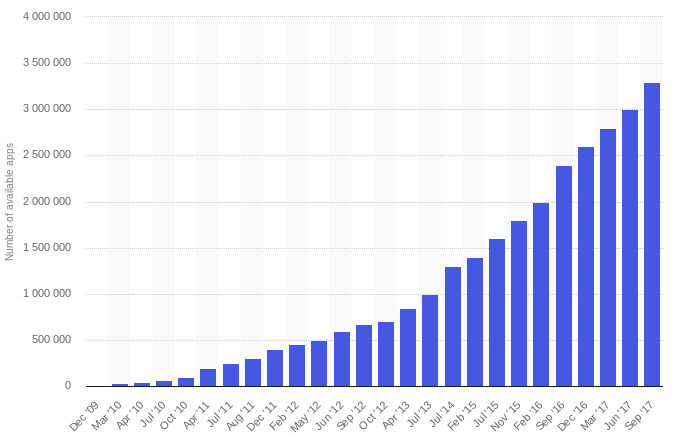{width="6.208333333333333in"
height="4.046824146981628in"}

Exhibit 2

*Source:
[[Statista]{.underline}](https://www.statista.com/statistics/266210/number-of-available-applications-in-the-google-play-store/)^\[2\]^*

The paper discusses the security features that are provided by Google
and how the same can be leveraged by developers to make the applications
secure and robust. The security features provided by Google often
aren\'t implemented or are implemented in an improper way. This makes
the application vulnerable to the security issues. The paper will enable
developers to understand the security features and will also highlight
the benefits of implementing the same.

 
=

Introduction
============

Android is a open source Linux based software stack that is developed by
Google. It was initially developed by Android Inc. and was later bought
by Google. It is used by many commonly used devices such as smartphones,
tablets, wearables, smart TVs etc.

Android Software Stack
----------------------

The Android software stack is shown in Exhibit 3 and the same is
explained below:

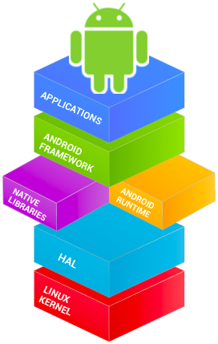{width="2.3202865266841646in" height="3.6475699912510935in"}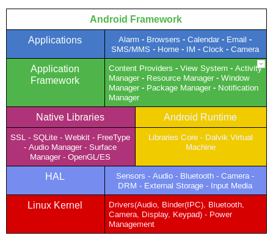{width="4.067708880139983in" height="3.5936931321084864in"}
===================================================================================================================================================================================================

Exhibit 3

*Insides of Android Platform*^\[3\]^

**Linux Kernel:** Android platform is built on the top of a robust Linux
kernel. The Linux kernel itself provides the advantage of underlying
security features such as process isolation, user-based permission model
etc.^\[4\]^ As shown in Exhibit 3 this layer provides all the essential
hardware drivers like camera, keypad, display etc.

As of 2017, Linux kernel v3.18 or v4.4 is used by Android devices.
However, The actual kernel depends on the individual device.

**Hardware Abstraction Layer:** Hardware Abstraction Layer gives the
Android Platform freedom to implement any device specifications and
drivers by providing the standard method for creating software hooks
between the Android platform stack and your hardware.

**Android Runtime:** It consist of core libraries and Dalvik Virtual
Machine(DVM). The core libraries are the Java based libraries that
provide the primary APIs for developers to write Android applications.

Each Android application runs as a different process on the Linux kernel
in its own Virtual machine. Just like JVM, DVM is also a virtual machine
but the latter is designed by Google specifically for mobile platforms.
For Android version 5.0 (API level 21) or higher, the successor of DVM
was introduced viz. ART(Android Runtime) which had the following
performance improvements over conventional DVM:

-   Compilation: Compiles the application only once using AOT(Ahead of
    > Time) approach.

-   Power Consumption: Reduces power consumption.

-   Garbage Collection: Optimizes garbage collection (GC).

**Native Libraries:** The core Java based libraries can be considered as
the java *wrappers* around the C/C++(Native) libraries. The platform
also allows developers to use C or C++ code to build Android
applications using native libraries in the native code through Android
NDK.

**Application Framework:** The Application Framework is a set of
services that collectively form the environment in which Android
applications run and are managed. It provides high-level services to the
applications through Java classes. Application developers use these
high-level services using Java APIs.

**Applications:** Applications are present at the top of the Android
software stack. It consists of both the native system applications and
the third party applications installed by the user.

APK: Android Application Package
--------------------------------

APK is an acronym used for Android Package Kit. It is a software package
that can be installed on Android devices. The software package uses .apk
extension. An APK is an archive i.e. a signed zip file that contains the
application's code, resources etc.

Exhibit 4 shows how Android application compilation and execution is
different from a java application.

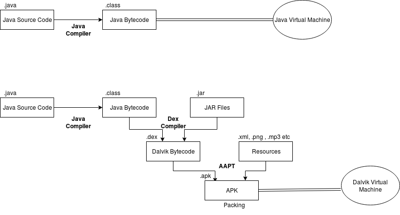{width="6.5in"
height="3.486111111111111in"}

Exhibit 4

*Compilation and Execution of Android Applications*

### APK Internals

APK is basically a signed zip archive that contains the application
code, resources, signing certificate etc. On unzipping the APK file we
can get the following:

-   AndroidManifest.xml: The manifest file describes the essential
    > information about the application. It defines the key attributes
    > of the application such as application components, permission
    > requirements, target and min API version, application icon,
    > package name etc.

-   META-INF: The META-INF contains the following:

    -   MANIFEST.MF: It is the manifest file and it contains the hashes
        > corresponding to application resources.

    -   CERT.SF: It is the signature file that is created after the
        > application is signed. It contains the list of resources and
        > the hash value of each resource corresponding to its entry in
        > the manifest file.

    -   CERT.RSA: It is the signature block file. The signature file is
        > a signed file and the signature of the same is placed in
        > signature block file. It also contains the certificate and its
        > metadata.

-   assets: It contains the applications assets(HTML/JS Files, pictures
    > etc.) The resources in assets folder can be accessed by Java code
    > using AssetManager.

-   classes.dex: This contains the Dalvik bytecode. All the Java code is
    > compiled into Dalvik bytecode and is executed by the DVM.

-   lib: It contains libraries that are part of the Android application.
    > The lib directory contains all the libraries that an application
    > may refer to during its execution and which is not a part of the
    > Android SDK.

-   res: The res directory contains all the application resources that
    > are not compiled in resources.arsc.

-   Resources.arsc: It is a file that contains all the pre-compiled
    > resources.

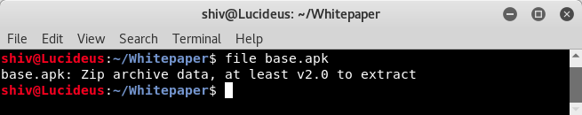{width="4.723958880139983in"
height="0.9387357830271216in"}

Exhibit 5

*File type of APK*

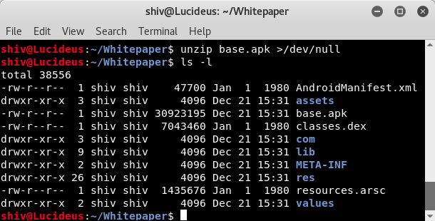{width="6.354166666666667in"
height="3.2291666666666665in"}

Exhibit 6

*Contents of an APK file*

### Android Application Components

Android application components are high level building blocks of an
Android application. Each Android application component is an entry
point through which a user or system can interact.

These components are well described in AndroidManifest.xml

The main Android application components are:

-   **Activity:** An activity can be considered as a *screen*. It is an
    > application component that has a user interface. A user can
    > interact with the application through activities. The activity
    > handles user interaction. Any Android application usually has one
    > or more activities.

-   **Service:** A service is an application component that usually
    > performs long running tasks in the background. Unlike activities,
    > a service lacks a user interface.

-   **Broadcast Receiver:** A broadcast receiver listens to system wide
    > broadcast announcements. Like services, broadcast receivers lacks
    > a user interface but the former is meant for long running tasks.

-   **Content Provider:** A content provider is an application component
    > that is used to store and share data efficiently. The data can be
    > stored in the file system, SQLite database etc.

**Intents**

An intent is an asynchronous messaging object that allows communication
between application components. It can be used for communication between
application components of same or different applications. It can be used
to start an activity, service or for delivering broadcasts.

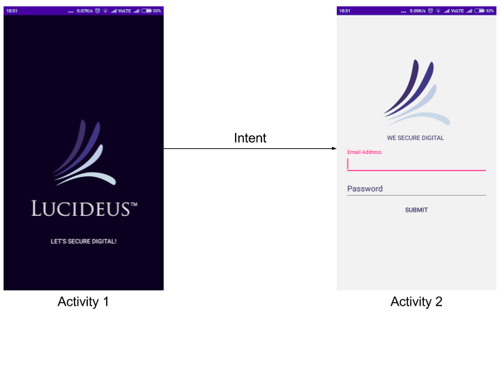{width="5.489583333333333in" height="3.4706474190726158in"}
=================================================================================================

Exhibit 7

*Intent to invoke an application component*

Background/Problem Statement
============================

Android is built on the top of the secure and robust Linux kernel. The
platform itself is considered to be secure due to multiple reasons few
of them being its openness, regular updates for security enhancements
and programs like
[[ASRP]{.underline}](https://www.google.com/about/appsecurity/android-rewards/)^\[5\]^(Android
Security Reward Programs) that attracts security researchers to build
the secure platform.

In addition to making the platform secure, Google also helps developers
build secure applications by providing features like [[SafteyNet
APIs]{.underline}](https://developer.android.com/training/safetynet/index.html)^\[6\]^
which helps them to add security to their applications and programs like
[[ASI]{.underline}](https://developer.android.com/google/play/asi.html)^\[7\]^(App
Security Improvement) that scans applications against 26 odd
vulnerabilities and notifies developers to remediate the issues.

In spite of having security features like SafteyNet, programs like ASI,
and the underlying robust platform the entire ecosystem can only be made
secure if the applications are built considering security in
SDLC(Software Development Life Cycle). The developers must be aware of
using the security features properly. For instance: Using encryption for
handling sensitive data will only solve the problem if it is implemented
in a proper way by using secure algorithms, secure key management etc.

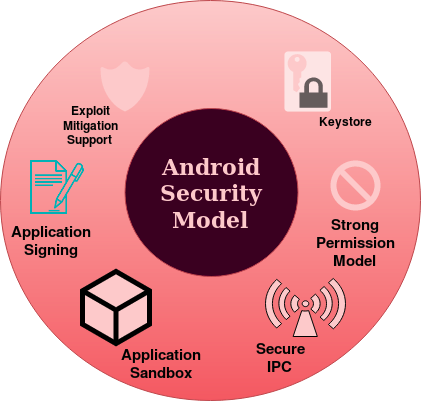{width="3.8987554680664918in"
height="3.713542213473316in"}

Exhibit 8

*Android Security Model*

Security Features By Google
===========================

Application Sandbox
-------------------

Android is built on top of a secure and robust multi-user Linux
operating system. The security features of Linux operating system are
thus an integral part of the Android platform. For instance, every user
in a linux operating system is identified by a unique user ID(UID) and
user's resources are also isolated from each other.

Android takes advantage of the underlying Linux kernel to achieve the
concept of *Application Sandbox*. An application installed in an Android
device is assigned a unique app ID and each application is considered as
a user of the underlying Linux OS. Also each user is allotted a private
directory*(/data/data/\<package-name\>*) which is the local data storage
directory of the application.

Application are sandboxed both at process level and at storage level
since each application executes as a dedicated process and each
application has its own private storage that can not be accessed by any
other application on the system.

*Note:* UIDs are statically defined in
[[android\_filesystem\_config.h]{.underline}](https://android.googlesource.com/platform/system/core/+/master/libcutils/include/private/android_filesystem_config.h)^\[8\]^
header file. For example, UID for root is 0. Also, UID 1000-9999 are
reserved for system processes. The UID for user application is from
*FIRST\_APPLICATION\_UID* to *LAST\_APPLICATION\_UID* (10000-99999)

The UID is represented as *uY\_aXXX* where xxx is an offset from
FIRST\_APPLICATION\_UID.

For Example: Exhibit 9 shows the results of the *ps* command for user
installed application *Effort On The Go* where the package name
*ebu.lucideus.com.effortonthego* is same as that of process name. The
user id is *u0\_a167* which is equivalent to *10167*
(10,000+offset\_167). Exhibit 10 shows the data directory for the
application.

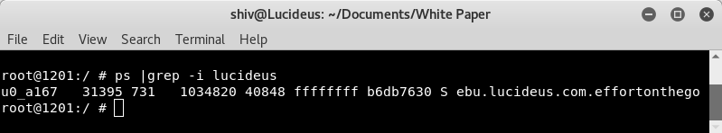{width="6.5in"
height="1.2083333333333333in"}

Exhibit 9

*Application Sandbox in Android Platform*

 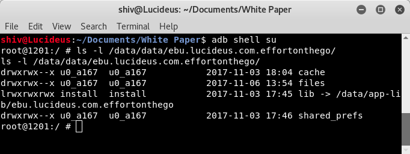{width="6.5in" height="2.1354166666666665in"}
------------------------------------------------------------------------------------

Exhibit 10

*Application Sandbox in Android Platform*

### Notes for Developers

#### World Accessible Files

By default, the files created in the application sandbox are not
accessible to other applications installed on the device. The flags like
[*[MODE\_WORLD\_READABLE]{.underline}*](https://developer.android.com/reference/android/content/Context.html#MODE_WORLD_READABLE)
^\[9\]^and
[*[MODE\_WORLD\_WRITABLE]{.underline}*](https://developer.android.com/reference/android/content/Context.html#MODE_WORLD_WRITEABLE)
^\[10\]^ allows developers to create world readable and writable files
respectively. The flags can be used for IPC(Inter Process Communication)
through system files.

These flags were deprecated in API level 17 and the usage of same for
application targeting API level 17 or below is strongly discouraged.
Android provides much better IPC mechanisms and it is recommended that
developers must use them instead of conventional world accessible files.
Explicitly specifying insecure file permissions such as *0666*,*0777*,
*0664* through syscalls or chmod binary is also strongly discouraged.

The best practice recommendation is to explicitly specify the secure
file permissions instead of relying on system's umask. Since the Android
application sandbox could collapse due to misconfiguration and
exploitation.

For Example:

[Creating File:]{.underline}

*FileOutputStream secureFile=openFileOutput("SecretFile",
Context.MODE\_PRIVATE);*

[Creating Folder:]{.underline}

*File secureDirectory=getDir("SecretDir",Context.MODE\_PRIVATE);*

#### Rooted Devices

Rooting an Android device allows a user to run any application as *root*
user. Android is built on the top of Linux kernel and rooting allows a
user to give administrative privileges to any application. This
collapses the application sandbox, since a root user can run any process
with any user ID and can also access private data of any application.
Rooting a device circumvents all the security measures of the operating
system.

From developer's point of view, a rooted device can impact the security
of the application since it allows any malicious application installed
on the rooted device to access the application's sandbox. It also allows
an attacker to perform the runtime analysis of the application where the
application could perform unintended actions when the runtime behaviour
of the application is modified.

For the applications that involve the flow of sensitive data, it is
recommended that the developers must detect and prevent the access from
a rooted device. Although there is no sure-shot solution for proper root
detection since root cloakers (Ex.
[[Magisk]{.underline}](https://forum.xda-developers.com/apps/magisk)
^\[11\]^) work with administrative privileges and root detection can be
bypassed but the checks indeed increases the attack complexity thus
reducing the overall risk. Developers can use [[SafteyNet Attestation
API]{.underline}](https://developer.android.com/training/safetynet/attestation.html),
the same being described in the later section.

 
-

Android Permission Model
------------------------

Application sandboxing allows Android applications to only access the
files that resides in its sandbox and world accessible files. This
limits the scope and functionality of the applications and in order to
prevent this Android permission model was designed. In order to provide
richer functionalities the model allows applications to request
additional fine grained access rights known as permissions.

Application can request permission and the same is granted to
application by either system or user depending on the type. These
permissions are listed in *AndroidManifest.xml* file.

### Permission Protection Levels

The Android system permissions are broadly categorized on the basis of
protection level into four categories. The two most important ones are
discussed below:

-   **Normal Permissions:** When the data/resources required by the
    > application outside the sandbox involves very little risk to
    > user's privacy.

> If an application requests for normal permissions, these permissions
> are automatically granted by the system.

-   **Dangerous Permissions:** When the data/resources required by the
    > application outside the sandbox involves user's privacy.

> If an application requests for dangerous permissions, these
> permissions are explicitly granted by the user.

#### Permission Groups

Android supports the concept of permission groups such that any
permission can belong to a permission group but since the normal
permissions are automatically granted by system the concept of
permission groups only affect if the permission is dangerous.

The other two categories are:

-   **Signature Permissions:** The permission with protection level
    > *Signature* is granted by the system only if the requesting
    > application is signed with the same certificate as the application
    > that declared the permission.

-   **signatureOrSystem Permission:** The permission with protection
    > level *signatureOrSystem* is granted by the system to applications
    > that are in the Android system image or that are signed with the
    > same certificate as the application that declared the permission.

**Granting and Revoking Android Permissions**

  **Device and Application Specifications**                                   **Requesting Permission**         **Revoking Permission**                                                                                                 
  --------------------------------------------------------------------------- --------------------------------- --------------------------------------------------------------- ------------------------------------------------------- ----------------------------------------------------------------
                                                                              **Normal Permission**             **Dangerous Permission**                                        **Dangerous Permission in the Same Group**              
  Device running API level 23 or higher **AND** *targetSDK* is 23 or higher   Automatically granted by system   Dialog box at runtime for user to explicitly grant permission   System automatically grants                             Permission can be revoked
  Device running API level 22 or lower **OR** *targetSDK* is 22 or lower      Automatically granted by system   The permission is granted at the time of installation           The permission is granted at the time of installation   Permission can only be revoked by uninstalling the application

Table 1

*[[Android Permission
Model]{.underline}](https://developer.android.com/guide/topics/permissions/requesting.html)^\[13\]^*

### Correlation of Application Sandbox and Android Permission Model

Android maps application UID with the corresponding metadata in
*/data/system/packages.list* file. This helps to correlate between two
different concepts namely Application Sandbox and Permission Model.

Exhibit 11 shows the metadata corresponding to the application UID

*root\@1201:/ \# cat /data/system/packages.list \|grep
/data/data/ebu.lucideus.com\>*

***ebu.lucideus.com.effortonthego** **10167** **1**
**/data/data/ebu.lucideus.com.effortonthego** **default** **3003***

Where each entry is defined below:

> ***ebu.lucideus.com.effortonthego***: Package Name
>
> ***10167***: UID assigned to application
>
> ***1***: Debuggable Status (1 if debuggable)
>
> ***/data/data/ebu.lucideus.com.effortonthego***: Application's private
> directory.
>
> ***default***: SEinfo label(Used by SE Linux)
>
> ***3003***: List of GIDs(Group IDs) that the application belong to,
> such that each GID is typically linked with Android permission.

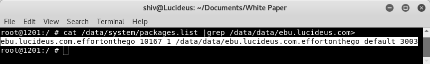{width="6.5in"
height="0.9861111111111112in"}

Exhibit 11

*Android application and its metadata*

### Notes for Developers

#### Excessive Permissions

An Android application should not request for the permissions that are
not even required by the application. This increases the attack surface
unnecessarily.

As the name implies, dangerous permissions request the data/resources
that involve users private information, hence even if one dangerous
permission is granted by the user, all the dangerous permissions in the
same group are granted implicitly. So it is recommended that the
dangerous permissions should be taken seriously and should only be
requested if required.

#### Securing Application Components Using Permissions

Android applications are built of application components such as
activities, receivers, services and providers. These application
components interact with each other so as to perform intended
functionalities.

In the scenarios where the scope of interaction of an application
component is limited to that of same application it is recommended that
the component developers should explicitly specify that the component is
non-exported in AndroidManifest.xml by setting the attribute
*android:exported* to false in the component\'s manifest element.

If the application component interacts with other components of the
developer's own application signed with same key. It is recommended that
the developers must use signature level permission in
*[android:protectionLevel](https://developer.android.com/guide/topics/manifest/permission-element.html#plevel)*
and the same permission must be specified in the component\'s manifest
element.

 
-

IPC: Inter Process Communication
--------------------------------

IPC(Inter Process Communication) is a mechanism which allows processes
to communicate with each other and allows them to synchronize their
actions.

Linux operating system allows several mechanisms to achieve IPC via
files, pipes, FIFO, sockets etc.

Android is built over Linux which supports the concept of [*[Binder
Framework]{.underline}*](https://www.nds.rub.de/media/attachments/files/2012/03/binder.pdf)^\[14\]^
i.e. it allows IPC through
[[RPC]{.underline}](https://en.wikipedia.org/wiki/Remote_procedure_call)^\[15\]^(Remote
Procedure Calls) between client and server processes. Binder framework
manages the underlying RPC mechanism and provides a simple user
interface by exposing the APIs. The infrastructure provided by binders
is used by in-process and cross-process calls.

### Intents

Intents supports the communication between application components. An
intent is a simple message object that represents an intention. They are
basically of two types:

#### Explicit Intents

Explicit intents specify the fully qualified class name of the component
with which the application wants to communicate. Since the name of the
component is explicitly mentioned in intent object the resolution
happens by invoking the recipient.

#### Implicit Intents

Implicit intents are sent to the Android system for resolution. Implicit
intents do not specify the application component to interact instead it
includes other attributes that help the system to resolve the intent.

### Intent Filters

Intent filters help the Android system to resolve implicit intents as
system compares the contents of the received implicit intent with the
intent filters declared in the manifest file of other applications
installed on the device.

-   In the scenario where the contents of an intent matches the intent
    > filter, the system invokes the component with matching intent
    > filters and it also passes the intent object.

-   In the scenario where multiple intent filters are compatible, the
    > system displays a dialog box for a user to select among various
    > application. The same is shown by Exhibit 12.

 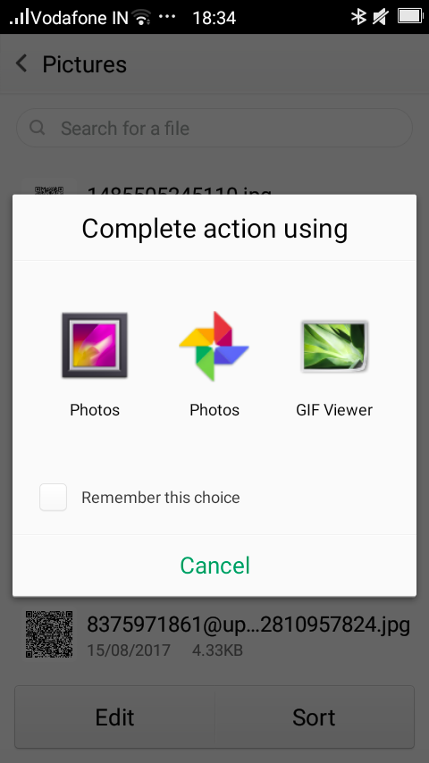{width="2.26922353455818in" height="4.026042213473316in"}
------------------------------------------------------------------------------------------------

Exhibit 12

*Resolution of implicit intents*

### Notes for Developers

#### Insecure IPC Mechanisms 

Developers sometimes use sockets(*localhost* network ports) for handling
sensitive IPC. Having said that, binding on
[[INADDR\_ANY]{.underline}](http://www.delorie.com/gnu/docs/glibc/libc_317.html)^\[16\]^
is even worse than using
[[INADDR\_LOOPBACK]{.underline}](http://www.delorie.com/gnu/docs/glibc/libc_317.html)^\[16\]^
as it will allow application to communicate from anywhere. Similarly
usage of world accessible for IPC is strongly discouraged.

It is recommended that developers should instead use Android IPC
mechanisms which allows the verification of identity of the application
that are trying to interact through IPC. For Ex: Usage of content
provider is an efficient and secure way of sharing data with other
applications than conventional world accessible files since it offers
fine-grained and dynamic access control in terms of read and write
permissions.

#### Insecure Android Broadcasts

Android allows applications to use broadcast to send messages to
multiple applications through the following ways:

**Normal Broadcast** through
[*[Context.sendBroadcast()]{.underline}*](https://developer.android.com/reference/android/content/Context.html#sendBroadcast(android.content.Intent,%20java.lang.String))^\[17\]^:
The normal broadcasts are asynchronous broadcasts i.e. these broadcasts
are sent to every registered receiver and they act in an asynchronous
fashion.

**Ordered Broadcast** through
*[[Context.sendOrderedBroadcast()]{.underline}](https://developer.android.com/reference/android/content/Context.html#sendOrderedBroadcast(android.content.Intent,%20java.lang.String))^\[18\]^:*
The ordered broadcasts are delivered based on priority associated with
every registered receiver. Priority is defined through
"*android:priority*" attribute. Receivers with higher priority received
it before those with lower priority.

**Sticky Broadcast** through
[*[Context.sendStickyBroadcast()]{.underline}*](https://developer.android.com/reference/android/content/Context.html#sendStickyBroadcast(android.content.Intent))^\[19\]^(*deprecated
in API 21*): These broadcasts are sticky in nature as they stay around
even after completion of broadcast such that receivers can receive these
intents even after their dormancy.

The following are the possible security issues associated with public
broadcasts:

-   Sensitive Data Exposure: In the scenario where an application sends
    > sensitive data in a public broadcast, a malicious application
    > installed on user's device could register a receiver with intent
    > filters having all possible actions, data and categories, in order
    > to receive all public broadcasts*. *

-   DOS(Denial of Service): In the scenario of ordered broadcast a
    > malicious application installed on user's device could register a
    > malicious receiver with high priority in order to receive the
    > broadcast on priority. On receipt of the broadcast the malicious
    > receiver could either drop the broadcast or inject malicious data,
    > resulting into the broadcast that is ultimately returned to the
    > sender causing DOS.

It is recommended that developers should use explicit intents if the
intent is destined for a single receiver and otherwise use [*[Local
Broadcast
Manager]{.underline}*](https://developer.android.com/reference/android/support/v4/content/LocalBroadcastManager.html)^\[20\]^
when the broadcast is not a public broadcast. Local broadcast manager is
a helper class to register local broadcast receiver and to send local
broadcasts. The broadcast remains within application and never goes
outside the current process. This is an efficient and secure way of
implementing local broadcasts.

In the scenarios where the broadcast is to be sent to the receiver of
the other application signed with the same key it is recommended that
signature permission must be created in the application manifest and the
same must be used at the time of initiating broadcast.

If the application has to interact with the broadcast receiver of other
applications the broadcast should never contain any sensitive data.

#### Insecure Implementation of Pending Intents

A pending intent is an intent whose execution can be delayed. A pending
intent can be sent to any application and the receiving application can
perform actions corresponding to it with same privileges and permissions
as that of the original application. Using pending intents, we allow a
foreign application to perform operations corresponding to intent as if
the the operations are performed by the very own application.

Since pending intents allows foreign applications to perform actions
corresponding to it, with the privileges of the original application and
hence it must be developed with security in mind.

Using an implicit intent for the pending intent is highly discouraged as
any application installed on user's device could intercept the implicit
intent and pass it on to an inappropriate location, while both the
intent originator and the intent recipient would remain unaware that the
intent had been intercepted. This could lead to sensitive data exposure
or redirection of intent that could lead to unintended behavior.

 
-

Exploit Mitigation Techniques
-----------------------------

Buffer Overflow is an anomaly where a program/process while writing data
to a buffer( fixed length
[buffer](http://searchcio-midmarket.techtarget.com/definition/buffer)
block of memory) overwrites adjacent memory locations of a buffer. It is
a serious software anomaly, since if exploited it can even allow an
attacker to control the underlying process. Exhibit 13 shows the simple
example of buffer overflow.

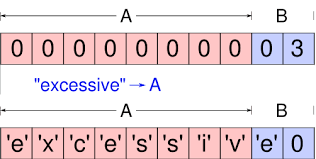{width="3.2916666666666665in"
height="1.65625in"}

Exhibit 13

*Buffer Overflow*

*Source:
[[Wikimedia]{.underline}](https://commons.wikimedia.org/wiki/File:Buffer_overflow_basicexample.svg)^\[21\]^*

In the usual scenario of exploitation of buffer overflow vulnerability,
attackers inject code into the adjacent memory locations of a buffer and
then redirects the execution to the injected code. This allows an
attacker to execute code with the privileges of a vulnerable
program/process. Attackers can also inject the garbage input to crash
the running process to create DOS(Denial of Service)

Android applications can have native components that are built using
native code(C/C++). Native code can create lots of security issues as
any input into Android native code can lead to memory exploitation
issues and can cause code execution or may crash the application.

Android supports technologies like
*[[ASLR]{.underline}](https://en.wikipedia.org/wiki/Address_space_layout_randomization)^\[22\]\[23\]^*(Address
Space Layout Randomization),
*[[NX]{.underline}](https://en.wikipedia.org/wiki/NX_bit)^\[23\]\[24\]^*(Never
eXecute),
*[[ProPolice]{.underline}](https://en.wikipedia.org/wiki/Buffer_overflow_protection#PROPOLICE)^\[23\[25\]\]^*,
*[[safe\_iop]{.underline}](https://www.wiley.com/en-us/Android+Hacker%27s+Handbook-p-9781118608647)^\[23\]^*
etc. to mitigate risks associated with common memory management issues.

### ASLR

ASLR is a mitigation concept that prevents exploitation of memory
corruption issues. As the name suggests ASLR randomly arranges the
address space position of key modules of a process like base of
executable, stack, heap etc in order to bring randomness.

### Data Execution Prevention

Android supports the concept of data execution prevention which prevents
attacker from executing the arbitrary code by disallowing the execution
of data.

Android supports this concept from API level 9 and above by supporting
the concept of hardware-based *NX*(No eXecute) to prevent code execution
on the stack and heap.

### Protecting Stack

Android also supports techniques to combat stack-based buffer overflows.
The concept of *[[stack
canaries]{.underline}](https://en.wikipedia.org/wiki/Buffer_overflow_protection#Canaries)^\[26\]^*
also known as cookies is used. It is a random value that is stored
before the return address of current stack frame and when a overflow
occurs the canary is also modified which indicates that the occurrence
of buffer overflow.

Android supports the concept of ProPolice from API level 3, the former
is a more effective than Stackgaurd.

### Notes for Developers

#### Leveraging Underlying Exploit Mitigation Techniques

Android supports exploit mitigation techniques such as ASLR, NX,
PRoPolice etc. but the underlying Linux kernel enables these protections
only and only if the binaries are compiled using these security options.
It is strongly recommended that developers must use these security
options.

-   ASLR: Linux kernel enables and disables ASLR based on information in
    > the information in the binary format of executable code module.

> Position independent binaries can be created when the executable is
> compiled with *-pie* and *-fpie* flags.

-   Non Executable Stack: Architectures corresponding to Android 2.3 and
    > later supports non-executable pages by default including non
    > executable stack and heap. But the underlying linux kernel marks
    > the underlying stack memory as executable unless the same is
    > explicitly specified through the compilation options of binary.

> The binary must be compiled with *-znoexecstack* option as it adds non
> executable flag for *GNU\_STACK* program header.

-   Stack Protection: In order to combat stack based buffer overflows
    > the ProPolice exploit mitigation must be enabled. The ProPolice
    > stack protection is enabled by using -fstack-protector compilation
    > option.

All the exploit mitigation mechanism supported by Android platform must
be enabled while compiling the binaries. Google has made this very
simple for Android developers as developers can use Android NDK(Native
Development Kit) as it enables all the exploit mitigation techniques by
default. It is strongly recommended that the developers use the latest
version of the Android NDK and must also target highest possible Android
API versions.

#### Usage of Banned Functions and Vulnerable Libraries

Even though Android provides lots of exploit mitigation techniques and
Android NDK enables them by default, this should not be considered as an
excuse for insecure coding. Developers must not completely rely on the
security of the underlying platform and instead concentrate more towards
coding a secure and robust application.

The usage of [[banned
functions]{.underline}](https://msdn.microsoft.com/en-us/library/bb288454.aspx)^\[27\]^
like *gets()*, *puts()*, *strcpy()*, *strcat()* etc. is very strongly
discouraged. Avoiding these banned functions in native code can lead to
significant reduction of potential security issues in native code.

Developers should also not use vulnerable third-party libraries. It is
recommended that the updated libraries with all the latest security
fixes must be used if required.

When dealing with native code, developers must consider each entry point
to be a potential security threat and should scrutinize each entry
point. For example, any data read from a world writable file, received
over a network or through IPC should be validated properly before
processing it through native code.

It is also recommended that the developers must follow [[secure coding
guidelines]{.underline}](https://wiki.sei.cmu.edu/confluence/display/seccode/SEI+CERT+Coding+Standards)^\[28\]\[29\]\[30\]^
while developing the code. It is also recommended that [[static code
analyzers]{.underline}](https://www.owasp.org/index.php/Source_Code_Analysis_Tools)^\[31\]\[32\]^
should be used.

 
-

Application Signing
-------------------

Android supports the concept of application signing such that it only
allows signed application packages to be installed on Android device.
Application signing ensures that the future updates to the application
are authentic and come from the same author.

### Digital Signature

Before diving deep into the concept of digital signatures let us first
understand the following concepts:

**Cryptography**

Cryptography is the science of hiding things. It is used for converting
plaintext to cipher-text such that the confidentiality of the secret
message is maintained. Basically cryptography is broadly classified into
two categories:

-   **Symmetric Key Cryptography:** It refers to the encryption
    > methodologies where both the parties share the same key. The key
    > is known as symmetric/secret key.

-   **Asymmetric Key Cryptography:** It refers to the encryption
    > methodologies where both the parties have different keys namely
    > public and private key. It is also known as public key
    > cryptography.

**Hashing**

Hashing is a cryptographic operation that converts the input message of
any length to value of fixed length known as hash/message digest. It is
implemented using a one way function i.e. it is not reversible.
Cryptographic hash functions are used to determine the integrity of the
input message.

 
-

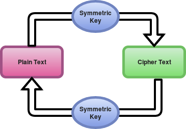{width="3.8020833333333335in"
height="2.65625in"}

Exhibit 14

*Symmetric Key Cryptography*

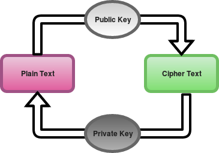{width="3.8020833333333335in"
height="2.65625in"}

Exhibit 15

*Asymmetric Key Cryptography*

{width="6.458333333333333in"
height="1.0729166666666667in"}

Exhibit 16

*Cryptographic Hash Function*

Now after understanding the basic cryptography mechanism it will be
easier to understand the concept of digital signature.

Digital signature is an application of cryptography that uses the
concepts of public key cryptography and cryptographic hash functions for
demonstrating the authenticity of digital messages or documents.

A valid digital signatures provides an authenticity of the sender and
along with that it helps the receiving party know that the integrity of
the message is maintained.

Exhibit 17 very well explains the mechanism of generation and
verification of digital signatures.

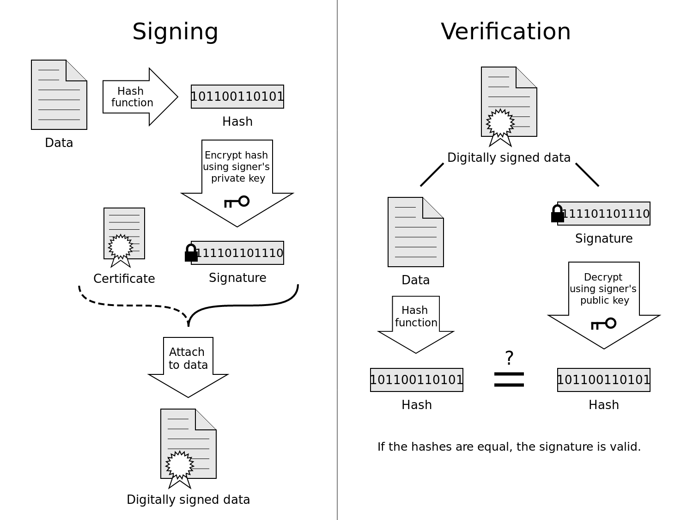{width="6.5in" height="4.875in"}

Exhibit 17

*Generation and Verification of Digital Signatures*

*Source:
[[Wikipedia]{.underline}](https://en.wikipedia.org/wiki/Talk:Digital_signature#/media/File:Digital_Signature_diagram.svg)*^\[33\]^

 Application Signing Process
----------------------------

For signing an Android application we need *Keystore.* A keystore is a
store that contains one or more keys. Basically there are two types of
keystores:

-   Debug Keystore: It is used during debugging phase of the Android
    > application development. The application signed using debug
    > keystore can not be pushed to application stores such as Google
    > Play.

-   Release Keystore: It is used for the signing of the release build.
    > The application signed with release keystore can be uploaded on
    > application stores such as Google Play.

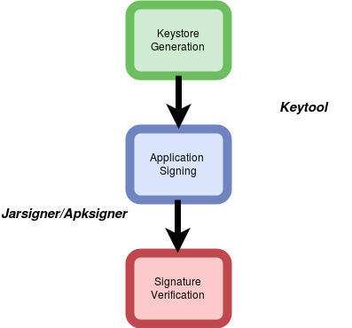{width="4.135416666666667in"
height="3.8541666666666665in"}

Exhibit 18

*Application Signing and Verification Process*

The following utilities are used during application signing:

[**[Keytool]{.underline}**](https://docs.oracle.com/javase/6/docs/technotes/tools/windows/keytool.html)^\[34\]^**:**
It is a Java utility and is part of Android SDK. It helps to manage
cryptographic keys, X.509 certificate chains, and trusted certificates.
As discussed, a keystore file may contain multiple keystores and each
one of them is identified by a unique alias.

A Keystore file is protected by two passwords one for keystore itself
and another for each entry in keystore.

It is recommended that the passwords used should be unique.

[**[Jarsigner]{.underline}**](https://docs.oracle.com/javase/7/docs/technotes/tools/windows/jarsigner.html)^\[35\]^**:**
It is also a Java utility that is part of Android SDK. The utility has
two main purpose, one is signing java archive and the other is
verification of signing. It generates digital signatures using key and
certificate information from keystore.

Once the APK is signed two additional files are created in the
application package namely MANIFEST.SF and CERT.XXX(where XXX depends on
usage of underlying algorithm eg. RSA, DSA etc.)

[**[Apksigner]{.underline}**](https://developer.android.com/studio/command-line/apksigner.html)^\[36\]^**:**
It is signing utility that is developed by Google. Google introduced a
new signing scheme(v2 Signing Scheme). It is used for the signing using
scheme v2. This signing scheme is considered more efficient and it also
provides more protections against unauthorized alterations to APK file.

### Notes for Developers

#### Insecure Signing Scheme

Signature scheme v1 only takes into the zip entries and ignores any
extra bytes while calculating and verifying the signatures. A serious
vulnerability (*[[Janus Vulnerability-CVE
2017-13156]{.underline}](https://www.guardsquare.com/en/blog/new-android-vulnerability-allows-attackers-modify-apps-without-affecting-their-signatures)^\[37\]^*)
was also identified in signature scheme v1 that allows attacker to
modify the code in application without affecting its signature.
Applications signed with signature scheme v2 and running on supporting
device are protected against the vulnerability.

It is recommended that developers must use signing scheme v2 over
signing scheme v1 as the latter do not properly protect the APK from
unauthorized alterations. Signature scheme v2 treats the APK as a *blob*
and performs the signature checking across the entire file.

#### Insecure Signing Algorithms

During application signing usage of weak cryptographic algorithm such as
*SHA-1*, *RSA-1024* etc. should be avoided in order to prevent security
issues. Hashing algorithms such as MD5, SHA-1 etc. are vulnerable to
[[collision]{.underline}](https://en.wikipedia.org/wiki/Collision_attack)^\[38\]\[39\]\[40\]^
attacks whereas encryption algorithm such as RSA-1024 is vulnerable to
multiple known cryptographic attacks making it weak and officially
deprecated.

It is also recommended that strong hashing algorithm such as *SHA-256*
be used. Also, instead of *RSA-1024*, *RSA-4096* or *RSA-2048* should be
used. However, *SHA256withRSA* and other better hashes are only
supported on API level 18 and above. It is without a doubt a security
versus compatibility trade off on which developers need to take a
decision.

 
-

Android Keystores 
------------------

### Keystore

As the name implies keystore is a storage facility that is used to store
keys and certificates. It can be implemented by a file or a hardware
device. Generally it is used to store the following entries:

-   **Private Key:** The encryption key that is used during asymmetric
    > encryption. It is used to sign a digital signature.

-   **Certificate:** It is a signing certificate that contains the
    > public key(asymmetric encryption) and metadata.

-   **Symmetric Key:** It is secret key that is used for symmetric key
    > cryptography.

There are different types of keystore depending on the underlying
implementations. For example,
[[JKS]{.underline}](https://docs.oracle.com/javase/7/docs/api/java/security/KeyStore.html)^\[41\]^(Java
KeyStore),
[[BKS]{.underline}](https://bouncycastle.org/specifications.html)^\[42\]^(Bouncycastle
KeyStore) etc.

### Android Keystore

Android platform supports the concept of Android Keystore. Android
Keystore system allows the secure storage of cryptographic keys that
makes the extraction of the stored keys difficult. The concept of
Android Keystore has undergone a tremendous evolution as shown in
Exhibit 18 and further discussions below.

Android supported the concept of *[[System Credential
Store]{.underline}](https://www.amazon.in/Android-Security-Internals-Depth-Architecture/dp/1593275811#reader_1593275811)^\[43\]^*
from Android 1.6. It was used to store the encryption key that was
derived using user's password. The key was used to encrypt VPN and WiFi
EAP credentials such that these credentials were stored encrypted on
disk. The System Credential Store was only accessible to system
applications and no public APIs were available.

Android introduced [[KeyChain
API]{.underline}](https://developer.android.com/reference/android/security/KeyChain.html)^\[44\]^
in Android 4.0-API 14. This API was provided to regulate the access to
System Credential Store. It allowed application developers to import
keys to system store. These keys were owned by *System* user. The keys
stored using Keychain API were not *per-app* keys, but any application
could request access to keys.

Android introduced the concept of Android Keystore Service in Android
API 4.3-API 18. It supported the concept of *per-app* keys such that key
generated for a given application could not be accessed by other
application. The service runs as *Keystore* user and the concerned files
are stored in */data/misc/keystore*.

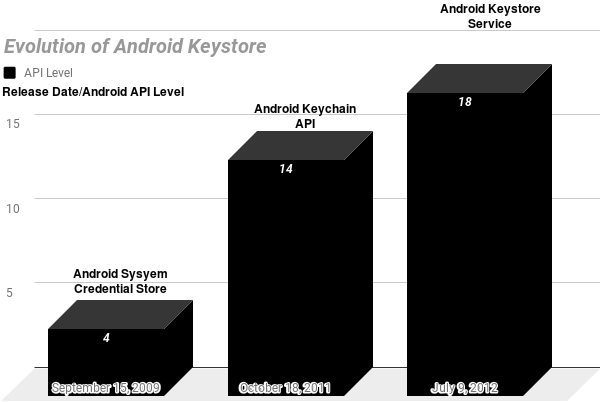{width="6.28125in"
height="4.1875in"}

Exhibit 19

*Evolution of Android Keystore*

#### Hardware Backed Keystore

##### TEE:Trusted Execution Environment

As the name implies
[[TEE]{.underline}](https://en.wikipedia.org/wiki/Trusted_execution_environment)^\[45\]^(Trusted
Execution Environment) is a secure region of the main processor. TEE is
meant for handling sensitive data such that it ensures that sensitive
data is stored, processed and protected in an isolated, *trusted
environment*.

[[ARM]{.underline}](https://en.wikipedia.org/wiki/ARM_architecture)^\[46\]^(Advanced
[[RISC]{.underline}](https://en.wikipedia.org/wiki/Reduced_instruction_set_computer)^\[47\]^(Reduced
Instruction Set Computing) Machine) is a family of RISC architecture for
computer processors. Organizations such as Qualcomm and Texas
Instruments make CPUs based on the architecture licensed from ARM. ARM
implements the concept of TEE through *[[ARM
Trustzone]{.underline}](https://www.arm.com/products/security-on-arm/trustzone)^\[48\]^*.
This technology provides hardware features to create a secure
environment separated from normal execution environment.

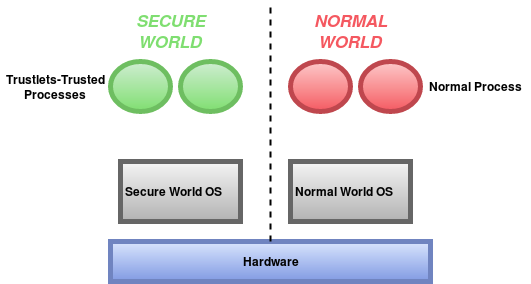{width="5.53125in"
height="2.9583333333333335in"}

Exhibit 20

*ARM Trustzone*

*Source: [[Analysis of Secure Key Storage Solutions on
Android]{.underline}](http://www.cs.kun.nl/~erikpoll/publications/AndroidSecureStorage.pdf)*

Exhibit 20 shows separation of the hardware in two worlds namely secure
world and normal world. Two isolated virtual environments are created
that includes virtual processors and virtual resources such that the
processes running in normal world can not access the secure resources
directly.

#### Keystore Entries

Keystore service maintains different directories for different user of
Android device. The entries are stored in */data/misc/keystore/user\_x*
where x is the Android user ID, starting with 0 for the primary user.
Exhibit 21 shows the storage of entries in *user\_0* directory. As
shown, each entry is owned by *keystore* user and is only accessible to
the same. The entries have a common naming convention of
***XXX\_YYY\_ZZZ**.* Where each underscore separated value has the
following meaning:

-   *XXX* is UID of the application that created the keystore.

-   *YYY* is type of entry, it can be one of the following:

    -   CACERT-CA Certificate

    -   USRCERT-User Certificate

    -   USRPKEY-Private Key

-   *ZZZ* is alias name.

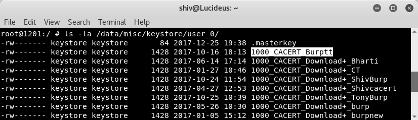{width="5.7088834208223975in"
height="1.6510422134733158in"}

Exhibit 21

*Keystore Entries*

Whenever any Android application generates a key pair using
*[[KeyPairGenerator]{.underline}](https://developer.android.com/reference/java/security/KeyPairGenerator.html)^\[47\]^*
API. The following entries are created in the keystore:

-   USRPKEY: The file stores the key pair parameters including the
    > private key.

-   USRCERT: The file stores the certificate for the publickey.

As shown in Exhibit 21, the very first entry in the keystore directory
is *.masterkey,* when the device is protected using secure lock screen
credential (e.g., password, PIN, or pattern) a random 128-bit AES master
key is used for encryption. This key is encrypted through a key derived
from user's credential using
*[[PBKDF]{.underline}](https://en.wikipedia.org/wiki/PBKDF2)^\[48\]^*(8192
rounds of *PKCS5\_PBKDF2\_HMAC\_SHA1*) and the encrypted key is stored
in *.masterkey* file.

For hardware-backed keystore, the key files are encrypted using a
device-specific key that is stored in TEE and cannot be retrieved to
normal world applications even with root access. When the key pair is
generated with
*[[setEncryptionRequired]{.underline}](https://developer.android.com/reference/android/security/KeyPairGeneratorSpec.Builder.html#setEncryptionRequired())^\[49\]^*
set to true, then keys will be *further* encrypted with a key derived
from secure lock screen credential (e.g., password, PIN, or pattern).
Having said that, the following are the cons if this security layer is
used:

-   The successful key pair generation requires that the secure lock
    > screen (e.g., password, PIN, pattern) is set up.

-   The generated key pair are automatically deleted when the secure
    > lock screen is disabled or reset.

-   The generated key pair cannot be used until the user unlocks the
    > secure lock screen after boot.

For API level 22 and below, the functionality/bug in Android keystore
encrypts all the keystore entries using masterkey, which may cause the
deletion of keystore files whenever lock screen credential is changed.
In API level 23, keys which do not require encryption at rest i.e. where
*setEncryptionRequired* is false, will no longer be deleted when secure
lock screen is disabled or reset. However, keys which require encryption
at rest will be deleted during these events.

SafteyNet: Developers Friend
----------------------------

SafteyNet is a set of services and APIs that was introduced by Google in
2013. It helps users and developers to secure the Android platform. It
protects the application against security threats, including device
tampering, bad URLs,
[[PHAs]{.underline}](https://source.android.com/security/reports/Google_Android_Security_PHA_classifications.pdf)^\[49\]^(Potentially
Harmful Applications), and fake users.

[[Google Play
Services]{.underline}](https://en.wikipedia.org/wiki/Google_Play_Services)^\[50\]^
starts an always-running service named
*[[snet]{.underline}](https://koz.io/inside-safetynet/)^\[51\]^*. This
service frequently collects various pieces of data from the device and
sends it back to Google's cloud, this makes Android devices to
contribute security-related information to Google's cloud services. The
information includes security events, logs, configuration etc. The
collected information is used in multiple ways such as ecosystem
analysis and threat profiling of the device.

Before 2016, user's enabling installation from unknown sources were
prompted to enable SafteyNet but from 2016 SafteyNet is enabled by
default on all Android devices with Google play.

### SafteyNet APIs

Google provides the following APIs that helps developers to assess the
health of Android device in which the application runs. It also help
developers to secure the Android application. The usage of SafteyNet API
is optional. However, it is strongly recommended that developers must
leverage the same.

-   [[SafetyNet Attestation
    > API]{.underline}](https://developer.android.com/training/safetynet/attestation.html)^12\]^

-   [[SafetyNet Verify Apps
    > API]{.underline}](https://developer.android.com/training/safetynet/verify-apps.html)^\[52\]^

-   [[SafetyNet reCAPTCHA
    > API]{.underline}](https://developer.android.com/training/safetynet/recaptcha.html)^\[53\]^

-   [[SafetyNet Safe Browsing
    > API]{.underline}](https://developer.android.com/training/safetynet/safebrowsing.html)^\[54\]^

#### SafetyNet Attestation API

SafteyNet Attestation API helps the developers to check the security and
compatibility of the Android device in which the application runs. The
API examines the software and hardware information on the device so as
to provide confidence to developers about the integrity of a device and
the application itself.

The features provided by this API is broadly categorized below:

##### Compatibility Test Suite Results

[[CTS]{.underline}](https://source.android.com/compatibility/cts/)^\[55\]^(Compatibility
Test Suite) is a free and commercial-grade test suite for Android and it
represents the \"mechanism\" of compatibility. For the certification
process for Google's applications, device manufacturers have to submit
their CTS test results. SafteyNet creates the profile of the device
based on the hardware and software information of the device. The
service then attempts to find this same profile within a list of device
models that have passed Android compatibility testing. If the device in
which the application is running meets the security and compatibility
requirements of Google the *ctsProfileMatch* response is returned.

##### Basic Integrity Checks

The API also helps us to check the integrity of the device so as to
determine whether or not the particular device has been tampered with or
otherwise modified. This provides developers with confidence about the
integrity of a device in which the application is running.

##### Application Integrity Checks

SafteyNet Attestation API allows developers to check the integrity of
the application that is using the API so that developers can assess
whether the calling app is legitimate.

##### Architecture

The workflow involved in SafteyNet Attestation API is explained below.

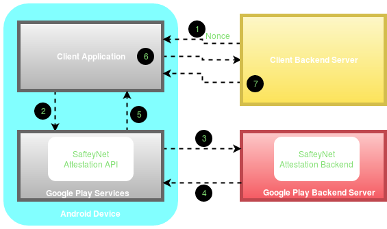{width="5.885416666666667in"
height="3.4895833333333335in"}

Exhibit 20

*SafetyNet Attestation API protocol*

1.  A
    > [[nonce]{.underline}](https://en.wikipedia.org/wiki/Cryptographic_nonce)^\[56\]^
    > is a random token generated in a cryptographically secure manner.
    > It is recommended that the nonce must be generated at server side
    > and sent to client over a secure connection. Usage of nonce
    > prevents from replay attacks.

2.  The application makes a call to the SafetyNet Attestation API via
    > Google Play Services.

3.  The SafetyNet Attestation API communicates with the backend server
    > and requests a signed response.

4.  The SafteyNet Attestation backend sends the response to Google Play
    > services. The received response is formatted as a
    > [[JWS]{.underline}](https://tools.ietf.org/html/rfc7515)^\[57\]^(JSON
    > Web Signature). The following JWS excerpt shows the format of the
    > payload data:

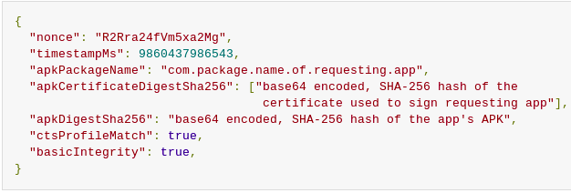{width="6.375in"
height="1.9583333333333333in"}

Exhibit 22

*Attestation Response*

Source: [*[Google SafteyNet Attestation
Document]{.underline}*](https://developer.android.com/training/safetynet/attestation.html)^\[12\]^

-   *ctsProfileMatch*: The value contains the result of CTS
    > compatibility. If the value is true then the profile of the device
    > running the application matches the profile of the device that has
    > passed Android compatibility testing.

-   *basicIntegrity*: The value contains the results of device's
    > integrity checks. If the value is true then the device running the
    > application wasn\'t tampered with. If the result is true, it
    > doesn\'t mean the device has passed Android compatibility test.

-   *apkPackageName*: The parameter provides the package name of the
    > application invoking SafteyNet Attestation API.

-   *apkCertificateDigestSha256*: The parameter provides the base64
    > encoded SHA-256 digest of certificate used to sign the
    > application.

-   *apkDigestSha256*: The parameter provides the base64 encoded SHA-256
    > hash of the application's APK file.

5.  The JWS attestation response is then sent to the application
    > requesting the services.

6.  One of the best thing of SafteyNet Attestation API is that, it can
    > be verified at the application server side. Application client
    > will send the received response to server for the verification.

7.  Application server processes the attestation response and sends the
    > result of the verification process back to the application. The
    > application server can then directly ask Google to verify the JWS
    > signature (or do it itself) and proceed to act on the results on
    > the server side, for example deny API access to the client.

Note: If the device running the application is CTS compatible, this does
not mean that the device is vulnerability-free. Google does not check if
a device is up to date or vulnerable to public exploits, as part of the
SafetyNet service. It checks if it has been tampered compared to an
expected normal and safe state.

SureShot Solution

As already discussed, there is no sure-shot mechanism of identifying the
rooted device. Root cloakers run with root privileges hence root
detection can be bypassed but, the checks indeed increases the attack
complexity thus reduces the overall risk. However, it is strongly
recommended that SafteyNet attestation API should be implemented in the
suggested way.

Application Integrity

The APK information *apkPackageName*, *apkCertificateDigestSha256* and
*apkDigestSha256* for the integrity checks of the application should
only be trusted if *ctsProfileMatch* is true.

Secure Implementation

-   It is strongly advised that security decisions must happen on the
    > server and not at the client as the client side code can be very
    > easily tampered. Instead, developers should send the entire JWS
    > response to their own server over a secure connection, for the
    > verification. The signed JWS response must be validated before
    > processing.

-   It is recommended that the attestation check must be performed for
    > all the critical workflows such as login, financial transactions
    > etc. However, attestation introduces latency, bandwidth, power
    > usage etc. and hence a balance between security and usability must
    > be maintained.

#### SafetyNet Verify Apps API

In early 2012, Google introduces an automated security scanner, to scan
new and existing applications for for malware, spyware, and trojan
viruses. In 2017, Google launched [[Google Play
Protect]{.underline}](https://en.droidwiki.org/wiki/Google_Play_Protect)^\[58\]^
which is a suite of safety services such as Verify Apps.

As per [Google's Android Security 2016 Year In
Review](https://source.android.com/security/reports/Google_Android_Security_2016_Report_Final.pdf)^\[59\]^,
Google scans all the Android devices at least once every six days and
devices with risk factors are scanned more frequently. Google Play
Protect improves the security of the underlying device in the following
ways:

-   It scans the applications before downloading from Google Play Store
    > and blocks the installation if the application is found to be a
    > PHA(Potentially Harmful Application).

-   It regularly scans the installed applications on the device and if
    > it finds the PHA, it may prompt the user to delete the application
    > or automatically remove the same.

Google Play Protect is available on all Android devices with Google Play
installed. It helps users to secure their Android device. Moreover, it
also helps application developers to get security insights of the
devices on which the application is running using SafetyNet Verify Apps
API.

SafteyNet verify Apps API allows the application to interact with Verify
Apps feature on device so as to protect the device against PHAs. It is
unlike SafteyNet Attestation API which checks for the device integrity.

Installed malicious applications on user's device may interact with the
other applications to let them behave in unintended manner. It is
strongly recommended that for the applications involving flow of
sensitive data, application developers should confirm that the device on
which the application is running is protected against malicious
applications.

#### SafetyNet reCAPTCHA API

SafteyNet reCAPTCHA API protects the application from malicious traffic.
It is developed to authenticate that the user is human and not a bot or
an automated tool. It uses an advanced risk analysis engine to protect
the applications from malicious traffic generated using a bot, automated
tool etc. If the service suspects that the user interacting with the
application may be a bot rather than a human, it serves a CAPTCHA that a
human must solve before the application can continue the execution.

#### SafetyNet Safe Browsing API

Google introduced safe browsing in 2005. It allows the applications to
check URLs against unsafe web resources such as phishing websites,
deceptive sites, malware hosting websites and hence prevents a user from
security threats. Whenever a user tries to access such web resources,
safe browsing enabled web browsers displays a warning to inform users
regarding the malicious web resource. The warning displayed is shown by
Exhibit 22.

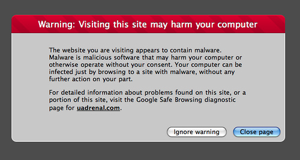{width="5.208333333333333in"
height="2.7708333333333335in"}

Exhibit 23

*Safe Browsing Warning Message*

Safe Browsing is a very popular security feature introduced by Google.
Approximately a billion users take advantage of Safe Browsing everyday.
(Source: *Google's Android Security 2016 Year In Review*^\[59\]^). The
protection is already enabled on the chrome browser on Android devices.

In mid-2016, Google released Safe Browsing API for third-party
developers, to protect their applications from malicious web resources.
The application can use SafteyNet Safe Browsing API to determine whether
a particular URL has been classified by Google as a known threat.
Developers can use Safe Browsing's database of known harmful URLs to
secure the application. It is strongly emphasised that application
developers should use this API to take full advantage of Google\'s Safe
Browsing service on Android in the most resource-optimized way.

### Notes for Developers

#### Lack of Rate Limiters

The lack of implementation of rate limiters on critical workflows such
as authentication, registration, initiating Email or OTPs etc. allows an
attacker to exploit the service using an automated tool. Few of the such
instances are briefly explained below:

-   Authentication Requests: An attacker may bruteforce user's
    > password/PIN/OTP in order to bypass authentication and login into
    > victim's account.

-   Initiating Email/OTP: An attacker may initiate several Email and/or
    > OTP requests for spamming, Denial of Service(DOS) etc.

It is advised that the developers must implement rate limiters such as
CAPTCHA in order to block malicious traffic generated by automated
tool/bots. The SafetyNet reCAPTCHA API can also be used for it to
protect the application from such attacks.

#### Insecure Implementation of Attestation API

SafteyNet Attestation API is the robust API that can be used by
application developers to build a secure Android applications.
Unfortunately sometimes the API is not implemented in the proper way by
the application developers. The following should be considered while
implementing the Attestation API:

-   Nonce Implementation: The nonce should be generated using a
    > cryptographic secure random function at the server side. It is
    > recommended that the nonce should be derived from multiple
    > user-specific details and a timestamp(Ex. Hash of username and
    > timestamp) to prevent replay attacks. Once the nonce is generated
    > at the server side it should be shared over secure connection with
    > the client and during the verification of attestation response it
    > should also be validated in the JWS response.

-   Client Side Verification: Verification of the attestation response
    > at the client side is strongly discouraged as the verification
    > logic can be easily tampered by modifying and repacking the
    > application.

-   Secure Server Side Verification: The verification must happen at the
    > server side such that the attestation response must be sent to the
    > server over a secure communication channel and the origin and the
    > integrity of the JWS message must be validated before processing
    > it further.

-   Updated Version: The SafetyNet Attestation API is continuously
    > evolving and the security features are also improving with time.
    > It is recommended that the developers should use the latest
    > version of SafteyNet APIs.

 
=

Some Other Security Practices
=============================

Secure Crypto Implementation
----------------------------

Cryptography is a science of hiding things. There are several scenarios
where the usage of cryptography is required to protect the
confidentiality and integrity of sensitive user data. The strength of
cryptography lies in its configuration and implementation. For an
instance, while implementing cryptography, using a strong cryptographic
algorithm alone is not enough as the security of otherwise strong
algorithms can be affected through their implementation. For Example,
poor key management may easily compromise strong encryption algorithms.

### Reducing Unnecessary Attack Surface

In the scenario where cryptography is required to secure the local data
storage, developers must avoid the storage of unnecessary data in the
application's local data storage. During the security evaluations of
different Android applications, often it is observed that the code
snippets introduced during development/debugging phase of the
application to store the sensitive information and/or [[Personally
Identifiable
Information(PII)]{.underline}](https://en.wikipedia.org/wiki/Personally_identifiable_information)^\[61\]^
of the user in the application's local data store were not removed by
the a application developers before releasing the production build. It
is recommended that the application should not capture unnecessary
sensitive data. Only the required sensitive data should be captured and
must be securely handled.

In scenario, where the application is required to store sensitive data
or user's PII in the local data storage of the application, developers
must manage the data securely using secure crypto implementations.

### Avoid Usage of Insecure and Custom Cryptographic Algorithms

The cryptographic algorithms and protocols that were considered as
secure couple of years back aren\'t viewed as secure any longer this is
in indeed due to the advancement in the computation. Established
algorithms which once required significant computing time, can now be
broken down in a matter of days or hours. This means that with the
expansion in computational power the security requirements must increase
accordingly. Cryptographic algorithms must be up to date and
in-accordance with the industry standards.

Usage of weak encryption algorithms such as DES, Triple DES, AES-ECB and
hashing algorithms such as MD4, MD5, SHA-1 is not advised since these
algorithms are vulnerable to known cryptographic attacks.

Usage of custom encryption algorithms are strongly discouraged. The
standard algorithms undergo research and are well tested. Usage of
custom algorithms is tedious, troublesome, and

likely to fail.

### It is recommended that following cryptographic algorithms should be used:

-   **Confidentiality Algorithms:** AES-GCM-256 or ChaCha20-Poly1305

-   **Integrity Algorithms:** SHA-256, SHA-384, SHA-512, Blake2

-   **Digital Signature Algorithms:** RSA (3072 bits and higher), ECDSA
    > with NIST P-384

-   **Key Establishment Algorithms:** RSA (3072 bits and higher), DH
    > (3072 bits or higher), ECDH with NIST P-384

Source: [*OWASP Mobile Testing Security
Guide*](https://github.com/OWASP/owasp-mstg/blob/master/Document/0x04g-Testing-Cryptography.md)^\[60\]^

### Avoid Insecure Key Derivation Mechanisms

As already discussed, the strength of cryptography not only depends on
the cryptographic algorithms but also on its implementation. Key
management is one of the most important process since poor key
management may easily compromise secure and strong algorithms. The
confidentiality and integrity provided by cryptographic processes such
as symmetric encryption and keyed hashes (MACs) depends on the secrecy
of the encryption key involved. In the event that the key is revealed,
the confidentiality and integrity provided is lost.

During security analysis of various Android applications often it is
found that the developers hard-code encryption keys in the application
source code. Sometimes, it is also observed that the encryption keys are
stored in the application resources or local data store. This way of key
management is insecure as an attacker can get access to the encryption
keys by reverse engineering the application. Even if the source code is
obfuscated, developers must not hardcode the encryption keys since
obfuscation only increases the analysis time and can be easily bypassed
using dynamic instrumentation.

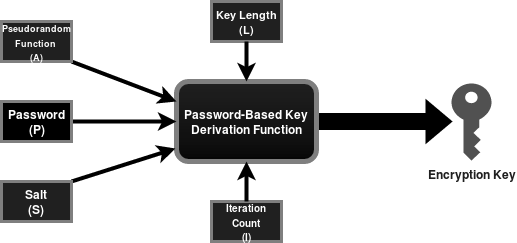{width="5.385416666666667in"
height="2.53125in"}

Exhibit 24

*Working of PBKDF2*

Since the security of information protected by cryptography directly
depends on the robustness of the keys, so the encryption keys must be
securely managed. It is recommended that developers use PBKDF2(Password
Based Key Derivation Function) for deriving the encryption key as shown
by Exhibit 24. It applies a cryptographic pseudo random function(A) such
as HMAC to the input value(P) along with a salt(S) and repeats the
process for specified iterations(I) to produce a key of the specified
length(L). The algorithm inherently blocks brute force attacks.

While implementing PBKDF2, developers must take care of the following:

-   The input value to the algorithm must not be hardcoded in the
    > application's source code and instead a user supplied password
    > should be used to derive encryption key. It is also recommended
    > that the application must enforce the usage of strong password
    > policies to further prevent possibilities of brute-force attacks.

-   The strength of PBKDF2 lies in its iteration count as it
    > traditionally serves the purpose of increasing the cost of key
    > generation from an input value. If the iteration count is too low,
    > the feasibility of an attack increases as an attacker may compute
    > \"rainbow tables\" for the application and may easily determine
    > the hashed password values. It is recommended that the key
    > derivation function should be used with 10,000 or more rounds of
    > iteration so as to make brute-force attacks expensive.

-   The encryption key can be derived at the time of registration/first
    > login and can be used to encrypt sensitive data and the same key
    > can be used to decrypt sensitive data whenever correct password is
    > supplied.

### Secure Pseudo Random Number Generation

During the function flow of the application, developers often use random
numbers for nonce, salt, IV(Initialization Vector) etc. It is strongly
recommended that the application developers use secure random numbers
instead of conventional random numbers. Since the latter does not
withstand cryptographic attacks. Application developers must use
*java.security.SecureRandom* instead of *java.util.Random* so as to
prevent insecure randomness errors that may occur in a
security-sensitive context.

Also, when random numbers are used application developers must avoid
explicit seeding to prevent deterministic random number generations. For
API levels 17 and below, calling *setSeed* method will make the RNG
(Random Number Generator) into a Deterministic RNG as it will only use
the supplied seed that may lack entropy. The default implementation
automatically seeds itself using the system random number generator
whereas for API level 18 and above the specified seed is just added to
the random state, so the RNG stays fully random.

 
-

Securing Android Webviews
-------------------------

Android allows developers to display web content directly into their
application through Webviews. In the past, Webview was tightly coupled
with the Android platform however, from Android 5.0

Google seperated Webview from the core Android platform in order to aid
separate security updates. It is shown by Exhibit 25.

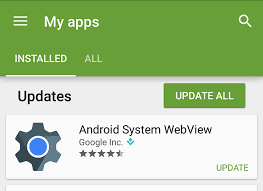{width="2.7395833333333335in"
height="1.9895833333333333in"}

Exhibit 25

*Decoupling of Webview from Android OS*

Usage of Webviews is very developer friendly and the same is
strengthened over the years but in spite of that it can be easily
abused. The following sections describes the recommendations of securely
using webviews.

### Webview Hardening

It strongly recommended that the Webview must be hardened properly
before usage. The following key points should be taken care while
working with Android webviews.

-   **Usage of JavaScript:** Whenever a webview instance is instantiated
    > the JavaScript is disabled by default. It is recommended that the
    > JavaScript should not be enabled unless it is very much required
    > as the usage of the same increases the attack surface. If
    > JavaScript is disabled, the impact of Man In The Middle attack is
    > reduced and it also prevents the application from Cross Site
    > Scripting(XSS) attacks.

> If the usage of JavaScript is required, then all the input consumed by
> the application must be validated at the server side. It is also
> recommended that the input must be encoded using encoding schemes such
> as URI/HTML encoding before it is sent as the part of HTTP response.

-   **Access to Content Providers:** Whenever an instance of Webview is
    > created, by default it has access to the content providers which
    > may unnecessarily increase the attack surface. In scenario where
    > the access to content providers is not required and the same is
    > not explicitly disabled, a compromise of Webview will also lead to
    > the compromise of content providers.

> It is recommended that if the access to content providers is not
> required it should be explicitly disabled using the
> *setAllowContentAccess* method.

-   **Access to File System:** Whenever an instance of Webview is
    > created, by default it has access to the file system which may
    > unnecessarily increase the attack surface. In scenario where the
    > access to file system is not required and the same is not
    > explicitly disabled, a compromise of Webview will also lead to the
    > compromise of file system.

> It is recommended that the if the file system access is not required
> it must be explicitly disabled using the *setAllowFileAccess* method.

-   **File Access From File URLs:** For API level 15 and below, whenever
    > an instance of webview is created, by default it allows JavaScript
    > running in context of a file scheme URLs to access resources on
    > the filesystem. It is recommended that If the application supports
    > API level 15 and below, it must be explicitly disabled using
    > *setAllowFileAccessFromFileURLs* to reduce the attack surface.

<!-- -->

-   **Universal File Access From File URLs:** For API level 15 and
    > below, whenever an instance of webview is created, by default it
    > allows JavaScript running in context of a file scheme URLs to
    > access content from any origin and the content from other file
    > scheme URLs. It is recommended that If the application supports
    > API level 15 and below, it must be explicitly disabled using
    > *setAllowUniversalAccessFromFileURLs* and
    > *setAllowFileAccessFromFileURLs* respectively so as to reduce the
    > attack surface.

### Preventing Excess Authorization

Android enables developers to inject Java objects into the webview, it
allows JavaScript to access the Java object methods. Developers can
create a bridge between JavaScript and Java using
*addJavascriptInterface* method. This is a very powerful feature, but it
had serious security issues for API levels JELLY\_BEAN and below.

API level 16 and below, allows JavaScript to execute all the public
methods (including the inherited ones) which can be abused in the
scenario where *addJavascriptInterface* method is invoked with untrusted
content in a WebView, leaving the application vulnerable to scripting
attacks using reflection to access public methods through JavaScript.

Application developers should refrain from calling
*addJavascriptInterface,* if the usage is required developers must not
support vulnerable Android versions (API level \<=16).

Also, the following things must be taken care when registering the
JavaScript interface:

1.  The JavaScript content should be shared over a secure connection.

2.  The JavaScript content should not be loaded from a
    > third-partyserver.

3.  Security measures to prevent Cross Site Scripting(XSS) attacks must
    > be strictly followed. In order to secure the application from XSS
    > attacks, application developers can refer [[XSS Prevention Cheat
    > Sheet]{.underline}](https://www.owasp.org/index.php/XSS_(Cross_Site_Scripting)_Prevention_Cheat_Sheet)^\[62\]^.

For API Levels 17 and above this issue was fixed as only public methods
annotated with JavascriptInterface could be accessed through JavaScript.

OWASP Dependency Check
----------------------

Application developers often use components(e.g., framework libraries)
that aren't written by them, as it is usually not realistic to write the
entire application code from the scratch. It is very usual that these
application components have vulnerabilities. An attacker can identify
these vulnerable components during information gathering phase and can
then frame the attack using publicly available exploit code.

There are known vulnerabilities in common libraries for Android
development such as
*[[OkHttp]{.underline}](https://www.cvedetails.com/cve/CVE-2016-2402/)^\[63\]^*
and *[[Apache Commons
I/O]{.underline}](https://www.cvedetails.com/product/32731/Apache-Commons-Collections.html?vendor_id=45)^\[64\]^*.

In order to reduce the attack surface, application developers must
remove unnecessary dependencies, features, components, files etc. Also,
application developers must maintain an inventory of the versions of
both client side and server side components and sources like
[*[CVE]{.underline}*](https://cve.mitre.org/)^\[65\]^ and
[*[NVD]{.underline}*](https://nvd.nist.gov/)^\[66\]^ must be
continuously monitored for vulnerabilities.

Fortunately *[[OWASP Dependency
Check](https://www.owasp.org/index.php/OWASP_Dependency_Check)\[]{.underline}*^67\]^
utility made the life of developers easy. The utility is maintained by
Jeremy Long, it identifies the project dependencies and reports on any
known, publicly disclosed, vulnerabilities.

The step by step guide of using the OWASP Dependency Check utility is
very well explained
[*[here]{.underline}*](https://medium.com/@appmattus/android-security-scanning-your-app-for-known-vulnerabilities-421384603fc5)^\[68\]^.

 
-

10 Things To Check Before Publishing The Application
----------------------------------------------------

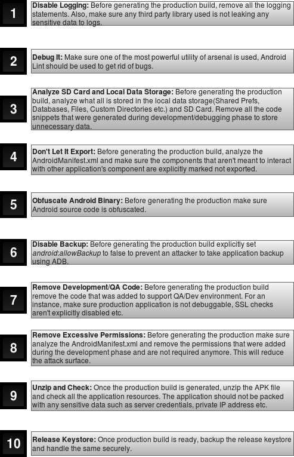{width="5.010416666666667in" height="7.776903980752406in"}
================================================================================================

Exhibit 26

Conclusion
==========

Adding security to the applications was yesterday's need. In the present
era of cyber security and cyber crimes, it is integral that security is
incorporated into the Software Development Life Cycle(SDLC) itself and
it goes hand-in-hand with development. The white paper will enable
developers and security researchers to securely code Android
applications leveraging its inherent security features.

The paper introduces the fundamentals of Android system architecture and
the internals of the Android application. This could serve as a bridge
between developers who have limited understanding of security and
security analysts with limited knowledge of development.

Several security features like SafetyNet APIs, Android Keystores,
Exploit Mitigation Techniques etc. are discussed in this paper. The
paper also addresses recommendations to common problems like missing
integrity checks, secure crypto implementations etc. In scenarios where
some of these features are already implemented, this paper could serve
as a baseline to distinguish the proper implementations from improper
ones.

 
=

About Author
============

**Shiv Sahni** is an information security professional with a master's
degree focused in Informatics from Institute of Informatics and
Communication, University of Delhi. He was also awarded a gold medal
from the University of Delhi for outstanding academic achievements. Shiv
is working as a Senior Security Analyst with Lucideus Technologies. He's
an Offensive Security Certified Professional and BSI certified ISMS Lead
Auditor and acquires the skills to perform automated as well as manual
vulnerability assessment and penetration testing along with the
abilities to provide code-level remedies to fix the open gaps. With
close to two years of work experience in web application, mobile
application and network vulnerability assessment and penetration
testing, he specializes in Android application vulnerability assessment
and penetration testing. Shiv has worked with government and private
industries to secure their digital infrastructure. Some of the many
industries include Banking, Financial Services and Insurance (BFSI),
Online/ ECommerce, Food & Beverages, Media etc.

Lucideus Technologies: The Author's Company
-------------------------------------------

**Lucideus Technologies** is an Indian cyber security company and is the
[best IT Startup in
India](http://pib.nic.in/newsite/PrintRelease.aspx?relid=157785) awarded
by the Government of India at National Entrepreneurship Awards 2016.
Incubated out of IIT Bombay, we are a pure play cyber security platforms
company. We provide IT risk assessment services and platforms to
corporates and governments across the globe. We build and deliver
information security services, both generic and customized to
proactively secure, continuously monitor and reactively respond to cyber
threats to your technology stack. Our objective is quantify digital risk
to inculcate a knowledge-based culture of safe and secure use of
technology, such that risk becomes an informed business decision leading
to minimal disruptions to your business and life.

About Technical Editor and Reviewer
-----------------------------------

**Vidit Baxi** is an information security analyst with 8 years of
experience in handling over 200 cyber security & incident response
projects across sectors around the globe. Areas of expertise include
Penetration Testing, Cyber Security Consulting, business process
analysis, and risk assessments. Vidit has tested a variety of
applications and hardware platforms to identify system-level as well as
architectural-level vulnerabilities, and supported Tech Teams in fixing
potential business risks to enhance the overall security stature of the
organizations. Working with Lucideus since its inception and has played
a vital role in setting up the cyber security services division and
relevant practices.

**Tony Thomas** is an Information security professional with 2 years of
experience in the fields of Web, Mobile and Network Security with his
core competence being Mobile Security. He has been an integral part of
securing various Infrastructures ranging from the Government
Organisations to Independant Private Enterprises. Being OSCP Certified,
he has also conducted various penetration tests for critical and
information sensitive environments. He has also delivered various
trainings across India to both the Development and Security Community.
Knowledge of the secure coding practices has enabled him to perform
source code review on various applications to identify logical bugs and
misconfigurations in them.

Acknowledgements
================

References
----------

\[1\] [https://www.gartner.com/newsroom/id/3725117]{.underline}

\[2\]
[https://www.statista.com/statistics/266210/number-of-available-applications-in-the-google-play-store/]{.underline}

\[3\]
[https://developer.android.com/guide/platform/index.html]{.underline}

\[4\]
[https://source.android.com/security/overview/kernel-security\#linux-security]{.underline}

\[5\]
[https://www.google.com/about/appsecurity/android-rewards/]{.underline}

\[6\]
[https://developer.android.com/training/safetynet/index.html]{.underline}

\[7\] [https://developer.android.com/google/play/asi.html]{.underline}

\[8\]
[https://android.googlesource.com/platform/system/core/+/master/libcutils/include/private/android\_filesystem\_config.h]{.underline}

\[9\]
[https://developer.android.com/reference/android/content/Context.html\#MODE\_WORLD\_READABLE]{.underline}

\[10\]
[https://developer.android.com/reference/android/content/Context.html\#MODE\_WORLD\_WRITEABLE]{.underline}

\[11\] [https://forum.xda-developers.com/apps/magisk]{.underline}

\[12\]
[https://developer.android.com/training/safetynet/attestation.html]{.underline}

\[13\]
[https://developer.android.com/guide/topics/permissions/requesting.html]{.underline}

\[14\]
[https://www.nds.rub.de/media/attachments/files/2012/03/binder.pdf]{.underline}

\[15\]
[https://en.wikipedia.org/wiki/Remote\_procedure\_call]{.underline}

\[16\]
[http://www.delorie.com/gnu/docs/glibc/libc\_317.html]{.underline}

\[17\]
[https://developer.android.com/reference/android/content/Context.html\#sendBroadcast(android.content.Intent)]{.underline}

\[18\]
[https://developer.android.com/reference/android/content/Context.html\#sendOrderedBroadcast(android.content.Intent,%20java.lang.String)]{.underline}

\[19\]
[https://developer.android.com/reference/android/content/Context.html\#sendStickyBroadcast(android.content.Intent)]{.underline}

\[20\]
[https://developer.android.com/reference/android/support/v4/content/LocalBroadcastManager.html]{.underline}

\[21\]
[https://commons.wikimedia.org/wiki/File:Buffer\_overflow\_basicexample.svg]{.underline}

\[22\]
[https://en.wikipedia.org/wiki/Address\_space\_layout\_randomization]{.underline}

\[23\] Chapter 12:
[https://www.wiley.com/en-us/Android+Hacker%27s+Handbook-p-9781118608647]{.underline}

\[24\] [https://en.wikipedia.org/wiki/NX\_bit]{.underline}

\[25\]
[https://en.wikipedia.org/wiki/Buffer\_overflow\_protection\#PROPOLICE]{.underline}

\[26\]
[https://en.wikipedia.org/wiki/Buffer\_overflow\_protection\#Canaries]{.underline}

\[27\]
[https://msdn.microsoft.com/en-us/library/bb288454.aspx]{.underline}

\[28\]
[https://wiki.sei.cmu.edu/confluence/display/seccode/SEI+CERT+Coding+Standards]{.underline}

\[29\]
[https://wiki.sei.cmu.edu/confluence/display/c/SEI+CERT+C+Coding+Standard?src=spaceshortcut]{.underline}

\[30\]
[https://wiki.sei.cmu.edu/confluence/pages/viewpage.action?pageId=88046682]{.underline}

\[31\]
[https://www.owasp.org/index.php/Source\_Code\_Analysis\_Tools]{.underline}

\[32\]
[https://github.com/MobSF/Mobile-Security-Framework-MobSF]{.underline}

\[33\]
[https://en.wikipedia.org/wiki/Talk:Digital\_signature\#/media/File:Digital\_Signature\_diagram.svg]{.underline}

\[34\]
[https://docs.oracle.com/javase/6/docs/technotes/tools/windows/keytool.html]{.underline}

\[35\]
[https://docs.oracle.com/javase/7/docs/technotes/tools/windows/jarsigner.html]{.underline}

\[36\]
[https://developer.android.com/studio/command-line/apksigner.html]{.underline}

\[37\]
[https://www.guardsquare.com/en/blog/new-android-vulnerability-allows-attackers-modify-apps-without-affecting-their-signatures]{.underline}

\[38\] [https://en.wikipedia.org/wiki/Collision\_attack]{.underline}

\[39\]
[https://en.wikipedia.org/wiki/MD5\#Collision\_vulnerabilities]{.underline}

\[40\]
[https://security.googleblog.com/2017/02/announcing-first-sha1-collision.html]{.underline}

\[41\]
[https://docs.oracle.com/javase/7/docs/api/java/security/KeyStore.html]{.underline}

\[42\] [https://bouncycastle.org/specifications.html]{.underline}

\[43\] Chapter 7
[https://www.amazon.in/Android-Security-Internals-Depth-Architecture/dp/1593275811\#reader\_1593275811]{.underline}

\[44\]
[https://developer.android.com/reference/android/security/KeyChain.html]{.underline}

\[45\]
[https://en.wikipedia.org/wiki/Trusted\_execution\_environment]{.underline}

\[46\]
[https://en.wikipedia.org/wiki/Reduced\_instruction\_set\_computer]{.underline}

\[47\]
[https://developer.android.com/reference/java/security/KeyPairGenerator.html]{.underline}

\[48\] [https://en.wikipedia.org/wiki/PBKDF2]{.underline}

\[49\]
[https://source.android.com/security/reports/Google\_Android\_Security\_PHA\_classifications.pdf]{.underline}

\[50\]
[https://en.wikipedia.org/wiki/Google\_Play\_Services]{.underline}

\[51\] [https://koz.io/inside-safetynet/]{.underline}

\[52\]
[https://developer.android.com/training/safetynet/verify-apps.html]{.underline}

\[53\]
[https://developer.android.com/training/safetynet/recaptcha.html]{.underline}

\[54\]
[https://developer.android.com/training/safetynet/safebrowsing.html]{.underline}

\[55\] [https://source.android.com/compatibility/cts/]{.underline}

\[56\] [https://en.wikipedia.org/wiki/Cryptographic\_nonce]{.underline}

\[57\] [https://tools.ietf.org/html/rfc7515]{.underline}

\[58\] [https://en.droidwiki.org/wiki/Google\_Play\_Protect]{.underline}

\[59\]
[https://source.android.com/security/reports/Google\_Android\_Security\_2016\_Report\_Final.pdf]{.underline}

\[60\]
[https://github.com/OWASP/owasp-mstg/blob/master/Document/0x04g-Testing-Cryptography.md]{.underline}

\[61\]
[https://en.wikipedia.org/wiki/Personally\_identifiable\_information]{.underline}

\[62\]
[https://www.owasp.org/index.php/XSS\_(Cross\_Site\_Scripting)\_Prevention\_Cheat\_Sheet]{.underline}

\[63\] [https://www.cvedetails.com/cve/CVE-2016-2402/]{.underline}

\[64\]
[https://www.cvedetails.com/product/32731/Apache-Commons-Collections.html?vendor\_id=45]{.underline}

\[65\] [https://cve.mitre.org/]{.underline}

\[66\] [https://nvd.nist.gov]{.underline}

\[67\]
[https://www.owasp.org/index.php/OWASP\_Dependency\_Check]{.underline}

\[68\]
[[https://medium.com/\@appmattus/android-security-scanning-your-app-for-known-vulnerabilities-421384603fc5]{.underline}](https://medium.com/@appmattus/android-security-scanning-your-app-for-known-vulnerabilities-421384603fc5)

 
-

Additional Resources
--------------------

*OWASP Mobile Testing Guide*

[[https://github.com/OWASP/owasp-mstg]{.underline}](https://github.com/OWASP/owasp-mstg)

*Google's Android Security 2016 Year In Review*

[[https://source.android.com/security/reports/Google\_Android\_Security\_2016\_Report\_Final.pdf]{.underline}](https://source.android.com/security/reports/Google_Android_Security_2016_Report_Final.pdf)

*Carnegie Mellon University Secure Coding Blogs*

[[https://wiki.sei.cmu.edu/confluence/display/android/Android+Secure+Coding+Standard?src=spaceshortcut]{.underline}](https://wiki.sei.cmu.edu/confluence/display/android/Android+Secure+Coding+Standard?src=spaceshortcut)

*Android Security Internals*

[[https://www.nostarch.com/androidsecurity]{.underline}](https://www.nostarch.com/androidsecurity)

*Mobile Application Hacker's Handbook*

[[http://onlinelibrary.wiley.com/book/10.1002/9781119183655]{.underline}](http://onlinelibrary.wiley.com/book/10.1002/9781119183655)

*Android Hacker's Handbook*

[[https://www.wiley.com/en-us/Android+Hacker%27s+Handbook-p-9781118608647]{.underline}](https://www.wiley.com/en-us/Android+Hacker%27s+Handbook-p-9781118608647)

*Research Paper-Analysis of Secure Key Storage Solutions on Android*

[[http://www.cs.kun.nl/\~erikpoll/publications/AndroidSecureStorage.pdf]{.underline}](http://www.cs.kun.nl/~erikpoll/publications/AndroidSecureStorage.pdf)

*Research Paper- Analyzing WebView Vulnerabilities in Android
Applications*

[[https://pdfs.semanticscholar.org/99be/d589a51c763133c9fb4222beb35950c31788.pdf]{.underline}](https://pdfs.semanticscholar.org/99be/d589a51c763133c9fb4222beb35950c31788.pdf)

*SafetyNet: Google\'s tamper detection for Android by John Kozyrakis*

[[https://koz.io/inside-safetynet/]{.underline}](https://koz.io/inside-safetynet/)

*Android Developer Blogs*

[[https://developer.android.com/training/articles/security-tips.html\#IPC]{.underline}](https://developer.android.com/training/articles/security-tips.html#IPC)
